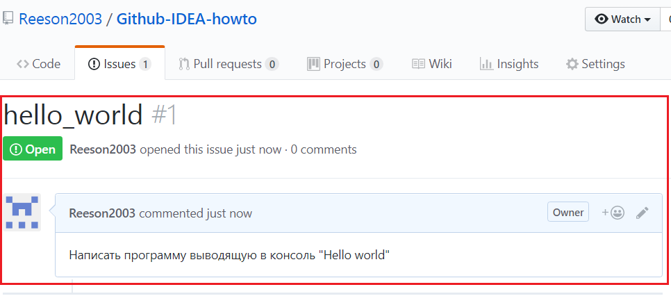
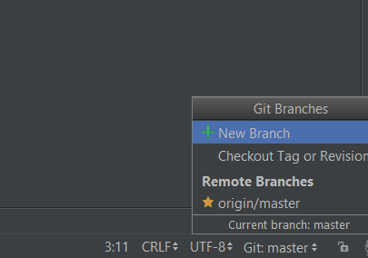
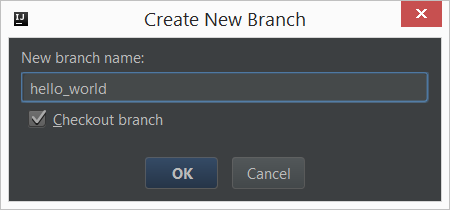
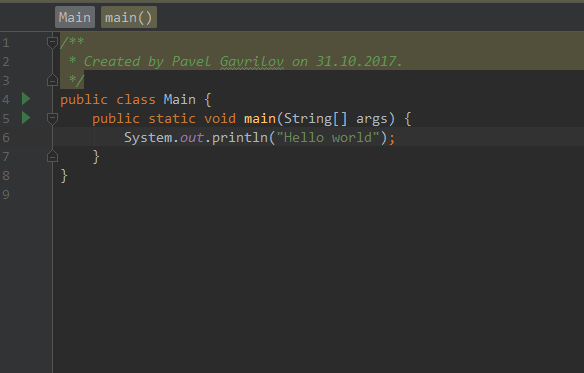
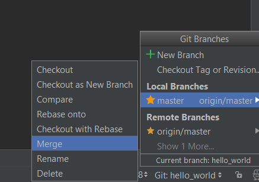
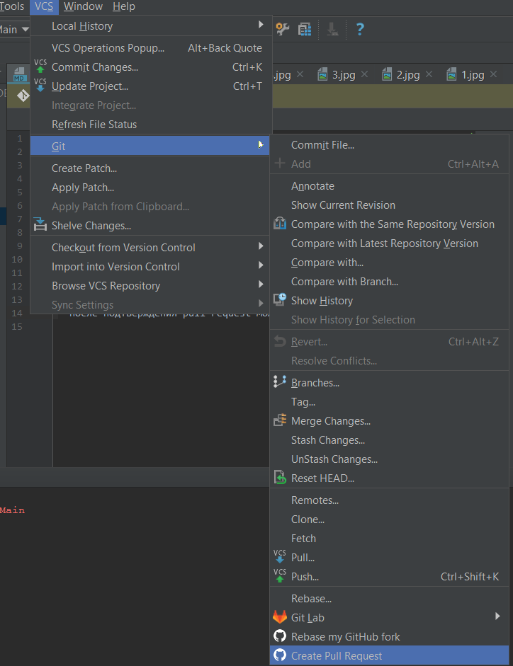
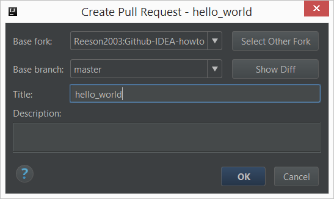

для испарвления бага / добавления фичи:
---
- создать issue на github 
- сделать ветку от master с названием issue

- сделать в ветке необходимые изменения

- сделать коммит
- переключиться на ветку master и обновить её
- переключиться на созданную ветку и сделать в неё мерж ветки мастер

- сделать пуш на github
- сделать pull request в ветку master

- после подтверждения pull request можно удалить ветку и закрыть issue
